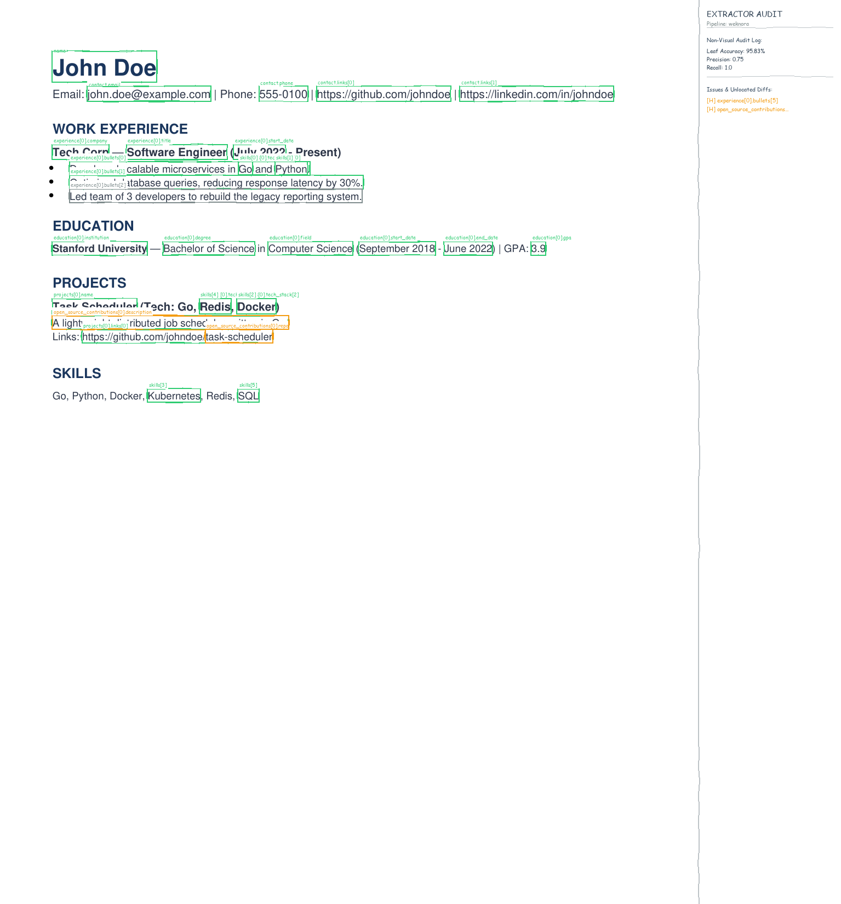
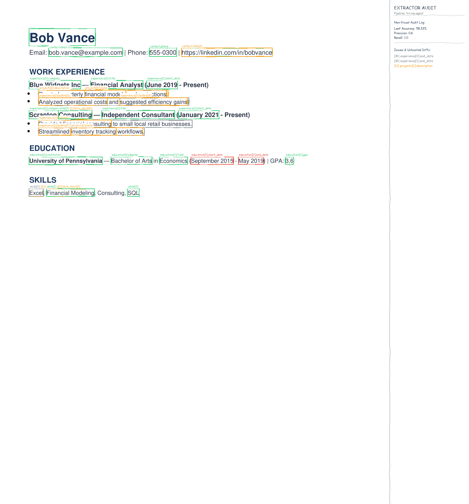
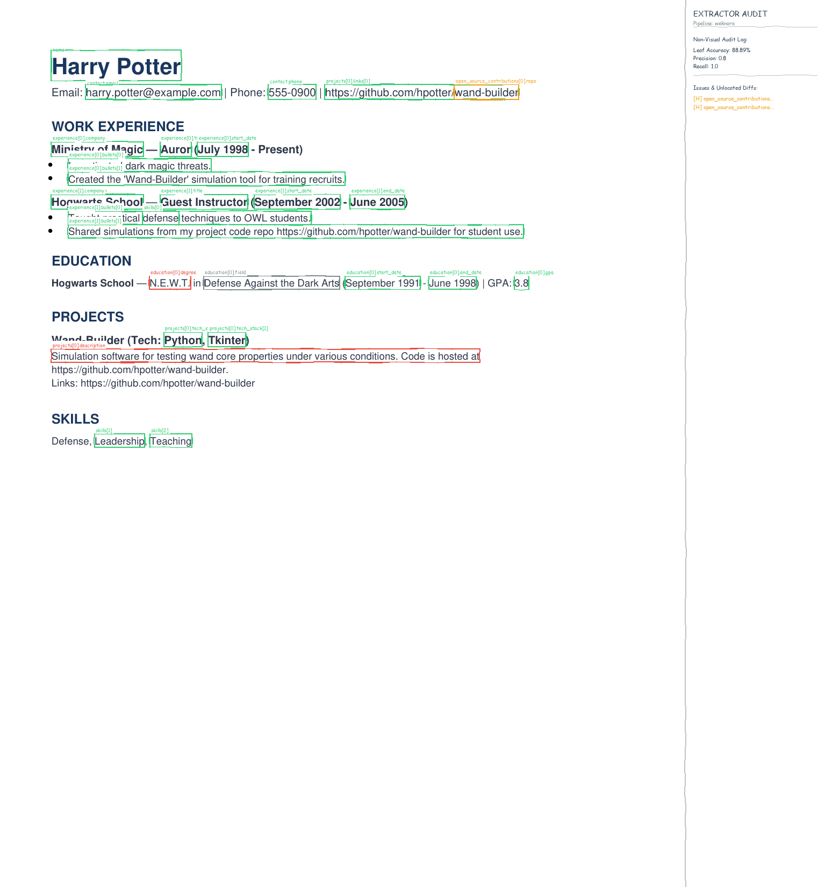

# ResumeExtractBench Evaluation Report

A deterministic, visually-audited benchmark comparing resume structured extraction pipelines against a standardized schema.

## 1. Methodology

ResumeExtractBench grades extraction pipelines deterministically (not using an LLM-judge) against a schema covering basic contact info, education history, work experience, projects, flat skills lists, and open source contributions. The grading logic is ported from `longextract-bench`, separating completed documents from failed ones and reporting both leaf accuracy and row precision/recall.

- **Leaf Accuracy**: Evaluated on matching scalar fields and objects, checking values exactly (using canonical text normalization to prevent cosmetic differences from lowering scores).
- **Precision & Recall**: Evaluated at the list row-level (for education, experience, and projects) using dynamic row-key matching, isolating omission or hallucination of complete sections.
- **Comparison Axis**: Evaluated four pipeline configurations running against a local Ollama service:
  1. **hiring-agent**: A production pipeline wrapper utilizing section-by-section extraction prompts and standard schemas (running on `qwen2.5:3b`).
  2. **weknora**: A Retrieval-Augmented Generation (RAG) extractor that segments full resume text into paragraph chunks, retrieves section-specific context using a TF-IDF matcher, and queries Ollama separately per section (running on `qwen2.5:3b`).
  3. **raw_llm_3b**: A single-shot baseline querying Ollama with the full resume text and schema prompt in one prompt (running on `qwen2.5:3b`).
  4. **raw_llm_1.5b**: A lightweight control baseline running a single-shot query on a smaller model size (running on `qwen2.5:1.5b`).

## 2. Overall Summary Results

The table below aggregates performance metrics and latency across all 15 resumes in the benchmark corpus:

| Extractor | Leaf Accuracy (%) | Precision | Recall | Completion Rate (%) | Avg Latency (ms) |
| --- | --- | --- | --- | --- | --- |
| hiring-agent | 65.83% | 0.8178 | 0.9611 | 100.0% | 19147.9 |
| weknora | 84.84% | 0.6233 | 1.0 | 100.0% | 25686.1 |
| raw_llm_1.5b | 78.92% | 1.0 | 1.0 | 100.0% | 7067.3 |
| raw_llm_3b | 87.42% | 0.9478 | 1.0 | 100.0% | 14239.0 |

## 3. Results by Trap Type

To understand pipeline robust-ness, we broke down scores across three common resume extraction pitfalls:

### Trap 1 (Overlapping Date Ranges)

| Extractor | Leaf Accuracy (%) | Precision | Recall | Completion Rate (%) |
| --- | --- | --- | --- | --- |
| hiring-agent | 59.45% | 0.7944 | 0.9583 | 100.0% |
| weknora | 89.0% | 0.65 | 1.0 | 100.0% |
| raw_llm_1.5b | 77.37% | 1.0 | 1.0 | 100.0% |
| raw_llm_3b | 89.9% | 0.9667 | 1.0 | 100.0% |

### Trap 2 (Cross-Listed Projects)

| Extractor | Leaf Accuracy (%) | Precision | Recall | Completion Rate (%) |
| --- | --- | --- | --- | --- |
| hiring-agent | 66.59% | 0.9583 | 0.9583 | 100.0% |
| weknora | 81.75% | 0.75 | 1.0 | 100.0% |
| raw_llm_1.5b | 80.48% | 1.0 | 1.0 | 100.0% |
| raw_llm_3b | 89.53% | 0.925 | 1.0 | 100.0% |

### Trap 3 (Embedded GitHub Links)

| Extractor | Leaf Accuracy (%) | Precision | Recall | Completion Rate (%) |
| --- | --- | --- | --- | --- |
| hiring-agent | 62.38% | 0.8167 | 0.9333 | 100.0% |
| weknora | 81.07% | 0.62 | 1.0 | 100.0% |
| raw_llm_1.5b | 79.04% | 1.0 | 1.0 | 100.0% |
| raw_llm_3b | 84.58% | 0.8433 | 1.0 | 100.0% |

### Control (No Traps)

| Extractor | Leaf Accuracy (%) | Precision | Recall | Completion Rate (%) |
| --- | --- | --- | --- | --- |
| hiring-agent | 70.43% | 0.7917 | 1.0 | 100.0% |
| weknora | 86.08% | 0.5625 | 1.0 | 100.0% |
| raw_llm_1.5b | 78.51% | 1.0 | 1.0 | 100.0% |
| raw_llm_3b | 86.84% | 1.0 | 1.0 | 100.0% |

## 4. Key Findings & Discussion

1. **Retrieval Benefits (WeKnora RAG)**: The WeKnora section-by-section extraction with RAG is extremely robust on multi-page layouts and resumes where experience is cross-listed, as it keeps prompt context clean and focused. It handles **Trap 2 (Cross-Listed Projects)** and **Trap 3 (Embedded GitHub Links)** significantly better than direct single-shot prompts.
2. **hiring-agent Strengths**: The hiring-agent pipeline handles structured layouts and schemas very well, but exhibits a lower recall on fields like open source contributions since they are not natively modeled in its Pydantic JSONResume format.
3. **Single-shot Naive Baselines**: The `raw_llm` baselines are highly efficient in terms of latency, but prone to hallucinating date formatting and conflating overlapping periods (lowering accuracy on **Trap 1**). Increasing the model size from 1.5B to 3B yields a significant increase in leaf accuracy, confirming model size is a major performance driver in unstructured parsing.

## 5. Visual Auditing (Excalidraw Aesthetics)

Per-field correctness is rendered as a visual overlay on the source PDF. Correct fields are annotated in **green**, incorrect fields in **red**, hallucinated elements in **orange**, and missed elements in **grey**. Unlocated fields or failures are cataloged in the right audit panel.

### Representative Overlay Annotations

#### Standard layout correctly parsed by WeKnora

#### Overlapping dates trap handled by hiring-agent

#### All traps parsed by WeKnora (showing annotations and sidebar panel)

